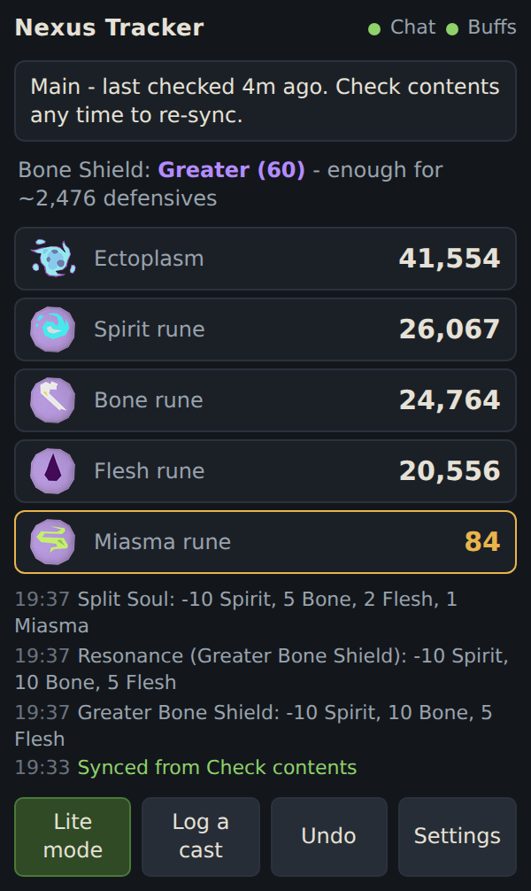
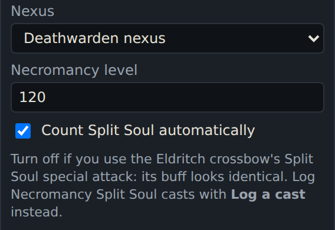
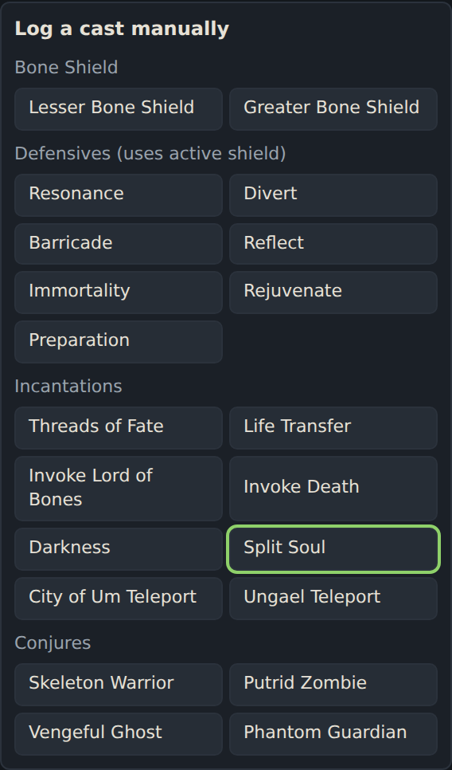
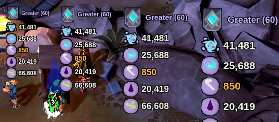
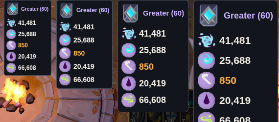

# Nexus Tracker

**An [Alt1](https://runeapps.org/alt1) app for RuneScape 3 that keeps count of the ectoplasm and necrotic runes in your Necromancy nexus, and warns you before you run out.**

Regular rune pouches warn you in chat when a rune is running low. The Deathwarden nexus,
Zemouregal's nexus and The Devourer's Nexus don't, so it's easy to go into a fight with no
Miasma left. Nexus Tracker watches your screen, subtracts runes and ectoplasm as you use your
abilities, and warns you when anything gets low.

> **Beta (v0.9.0).** It's been tested in game, but please
> [report anything that looks off](https://github.com/cuddlyzebra/nexus-tracker/issues).

<p>
  
</p>

## Install

1. You need [Alt1 Toolkit](https://runeapps.org/alt1) installed and running.
2. Paste this into the **address bar of Alt1's own browser** and accept the install:

   ```
   alt1://addapp/https://cuddlyzebra.github.io/nexus-tracker/appconfig.json
   ```

3. Open **Nexus Tracker** from the Alt1 toolbar and allow the *view screen* and *overlay* permissions.

## Getting started

1. **Sync once:** right-click your nexus and choose **Check contents**. The app reads the
   "Your nexus contains:" message from your chat box and saves your counts.
2. **Pick your nexus** in Settings. This matters for Zemouregal's nexus, which gives a stronger
   Bone Shield, and it picks the icon shown in lite mode.
3. **Use the Eldritch crossbow's special?** Read [Split Soul](#split-soul-and-the-eldritch-crossbow), because its buff looks identical to the Necromancy one.
4. **Play as normal.** Counts go down as you use your abilities, and are remembered between sessions.

Check contents again any time you like: the app re-syncs to the exact numbers and logs any correction.
**After adding runes to your nexus, always check contents** so the app knows about them.

Make sure game messages are visible in the chat box you have on screen, and keep your buff bar visible.

## What it tracks

Everything below is detected automatically.

| Ability | How it's detected | Cost |
|---|---|---|
| Lesser Bone Shield | Bone Shield buff appears | 5 Spirit, 5 Bone |
| Greater Bone Shield | Bone Shield buff appears | 10 Spirit, 10 Bone, 5 Flesh |
| Resonance, Divert, Barricade, Reflect, Immortality, Rejuvenate, Preparation | their buffs | same as your active Bone Shield (free without one) |
| Threads of Fate | buff | 5 Spirit, 2 Bone, 1 Flesh |
| Invoke Death | buff | 5 Spirit, 2 Bone, 2 Flesh, 1 Miasma |
| Invoke Lord of Bones | buff | 8 Spirit, 6 Bone, 2 Flesh, 1 Miasma |
| Split Soul | buff (see [Split Soul](#split-soul-and-the-eldritch-crossbow)) | 10 Spirit, 5 Bone, 2 Flesh, 1 Miasma |
| Darkness | buff, including reapplying it and multicast | 40 Spirit, 20 Bone, 10 Flesh, 5 Miasma |
| Life Transfer | its chat message, or your conjures' timers going up | 10 Spirit, 5 Bone, 2 Flesh, 1 Miasma |
| Single conjure (Skeleton, Zombie, Ghost, Phantom) | its buff appears | 1 Ectoplasm |
| Conjure Undead Army | several conjures appear together | 2 Ectoplasm per conjure |
| City of Um / Ungael teleport | **Log a cast** button | 5 Spirit |

**Lesser or Greater?** The app tells them apart from the number on the Bone Shield buff. That
number is 25% / 50% of your Necromancy level with the Deathwarden or Devourer's nexus, and
37.5% / 62.5% with Zemouregal's (for example, 30 / 60 at level 120).

## How it counts

The app never sees your keybinds. It watches your buff bar (and chat, for Life Transfer)
and works out what you did from what changes there.

**A new cast.** A buff appearing on the bar counts as one cast, and its cost comes off straight away.

**Recasting while the buff is still up.** Timers only ever count down on their own, so a timer
jumping back up means you used the ability again. That counts as another cast.
For example, pressing Invoke Lord of Bones every few seconds to stay in combat resets its
timer to 60 each time, and every press is charged 8 Spirit, 6 Bone, 2 Flesh and 1 Miasma.
Presses need to be at least 2-3 seconds apart: two presses within a second or two only
count once, because the timer hasn't dropped far enough to visibly jump back up.

**Reapplying Darkness.** Darkness starts at 12m and each cast adds 12 minutes, up to 1 hour.
Reapplying it before it runs out (for example at 11m) makes the timer jump up by about 12m,
which counts as one cast. The right-click **multicast** fills it to 1 hour in one go, so the timer
going up to the full hour is charged as a multicast, even when it only tops up a few minutes.

**Buffs that flash or briefly disappear.** RuneScape makes buffs flash as they run out, and
an interface can briefly cover the bar. A buff that comes back with its timer carrying on from
where it was (for example 3s left, gone, then back at 1s) is the same cast, not a new one.
The Bone Shield buff reappearing within 3 seconds is treated the same way. Buffs that are already
on your bar when you open the app aren't charged.

**One cast, one charge.** An ability can't be counted twice within half its cooldown,
for example 30s for Split Soul or 15s for Reflect. That catches any double detection that
slips through. Invoke Lord of Bones and Darkness have no (or almost no) cooldown, so they
rely on the timer checks above.

**Casting just before Check contents.** The app needs about a second to confirm some casts. A
cast made just before you check contents is already included in the numbers the check gives, so
it isn't charged again afterwards.

**Big buff bars.** The app reads buff bars up to 10 buffs wide and 3 rows deep, including
buffs that are flashing.

## Split Soul and the Eldritch crossbow

Split Soul exists twice in RuneScape. The **Necromancy incantation** costs 10 Spirit, 5 Bone, 2 Flesh
and 1 Miasma. The **Eldritch crossbow's special attack** costs no runes. Both put exactly the same
buff on your buff bar, so the app can't tell them apart by looking.

Settings has a tick box for this:

<p>
  
</p>

| How you play | Setting | What happens |
|---|---|---|
| Only Necromancy's Split Soul | **On** (default) | Every Split Soul buff costs Necromancy runes, automatically. |
| Only the Eldritch crossbow | **Off** | Split Soul buffs are ignored, so they never cost runes. |
| Both | **Off** | Crossbow casts are ignored; log each Necromancy Split Soul yourself (below). |

To log a Necromancy Split Soul by hand, press **Log a cast** in the app window and pick
**Split Soul**. The runes come off straight away, and **Undo** takes them back if you tap the wrong one.

<p>
  
</p>

If your counts ever drift from Check contents, use Settings → **Copy log**. Split Soul buffs the
app ignored because of this setting are listed there as "not counted".

## Lite mode

Press **Lite mode** to put a small panel on your game screen showing your nexus and the five
counts. Numbers turn **orange** when low and **red** when empty, and it shows your active Bone
Shield. Your clicks go straight through it to the game.

<p>
  
</p>
<p>
  
</p>

- **Move panel:** the panel follows your mouse. Press **Alt+1** to drop it, and the position is remembered.
- **Settings → Lite mode panel:** vertical or horizontal layout, four sizes (Compact to Extra
  large), and a solid panel or no background.
- While lite mode is on, the app window shrinks to a small control strip that you can make tiny and
  tuck away. Keep it open, because it's still doing the tracking.

## Warnings

When an item drops below its warning level, the app turns it orange, shows a message in the
middle of your game screen, and beeps. It warns again when an item runs out. Set the levels,
and turn the message or sound off, in Settings.

Default warning levels: **1,000** Ectoplasm, Spirit, Bone and Flesh runes; **500** Miasma runes.

## More

- **Two accounts:** Settings → Account keeps separate counts per account. Pick the right one in each Alt1 window.
- **Undo:** reverses the last charge if something was counted by mistake.
- **Copy log:** Settings → Copy log copies the full history (last 400 entries) with the reason for each charge. Paste it into a bug report.
- **Log a cast:** add a charge by hand (for teleports, or anything the app missed).
- **Correct counts:** set any number by hand in Settings. Check contents does this for you anyway.
- **Teach mode:** only needed if a game update changes a buff icon. Turn it on, use the ability,
  and name the new buff when the app asks.

## Known limits

- Runes you add to the nexus only show up once you **Check contents** again.
- If you wear a real shield while Bone Shield is still running, defensives are still charged,
  because the app can't see your off-hand.
- If your buff bar is covered by an interface when a buff appears, that cast can be missed.
  Checking contents fixes the numbers.
- Alt1 overlays can't be partly transparent, so lite mode offers a solid panel or no background.
- Two presses of the same ability within a second or two of each other count as one.
- The Eldritch crossbow's Split Soul looks identical to the Necromancy one. See [Split Soul](#split-soul-and-the-eldritch-crossbow).

## Reporting a problem

[Open an issue](https://github.com/cuddlyzebra/nexus-tracker/issues) and include:

- what you did,
- what the app showed vs. what Check contents said,
- the text from Settings → **Copy log**,
- a screenshot of the app and your buff bar, if you can.

---

## For developers

The app is plain TypeScript bundled with esbuild. It uses the
[skillbert/alt1](https://github.com/skillbert/alt1) libraries (vendored in `vendor/alt1`) to read
the chat box and buff bar. GitHub Pages serves the built app from `docs/`.

```sh
npm install        # installs esbuild
npm run build      # src/ -> docs/
npm test           # tests against real in-game screenshots in tests/fixtures
npm start          # preview at http://localhost:7280/?demo (sample data)
npm run typecheck  # optional, needs TypeScript
```

To release, run `npm run build` and push to `main`. GitHub Pages serves `docs/`, and Alt1
picks up the new version the next time the app is opened.

| Path | What it is |
|---|---|
| `src/core/` | game data and costs, chat parsing, tracker, buff event logic (no Alt1 code, fully tested) |
| `src/readers.ts` | Alt1 screen reading: chat box, buff bar, buff icon matching |
| `src/lite.ts` | lite mode overlay rendering |
| `src/app.ts` | app wiring and UI |
| `src/buffs/templates.json` | built-in buff icons (captured with teach mode) |
| `vendor/alt1/` | alt1 libraries pre-converted to build without webpack (see its README) |
| `tests/` | `run.ts` test suite; `e2e_browser.py` optional full-app test with a fake Alt1 |

Alt1 won't install apps from a local `http://localhost` address, so test changes in game by
pushing to GitHub Pages (or a fork).

Built with the [RuneApps Alt1 toolkit](https://runeapps.org/alt1). Not affiliated with Jagex.

## License

Nexus Tracker is released under the [MIT License](LICENSE).
The Alt1 libraries in `vendor/alt1` belong to [skillbert/alt1](https://github.com/skillbert/alt1) and are not covered by this license.
